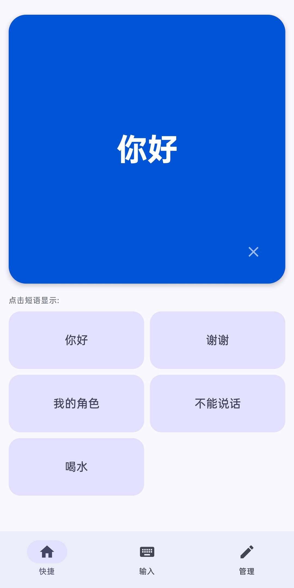
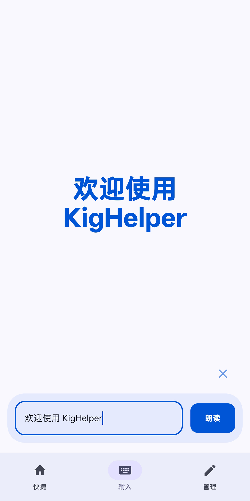
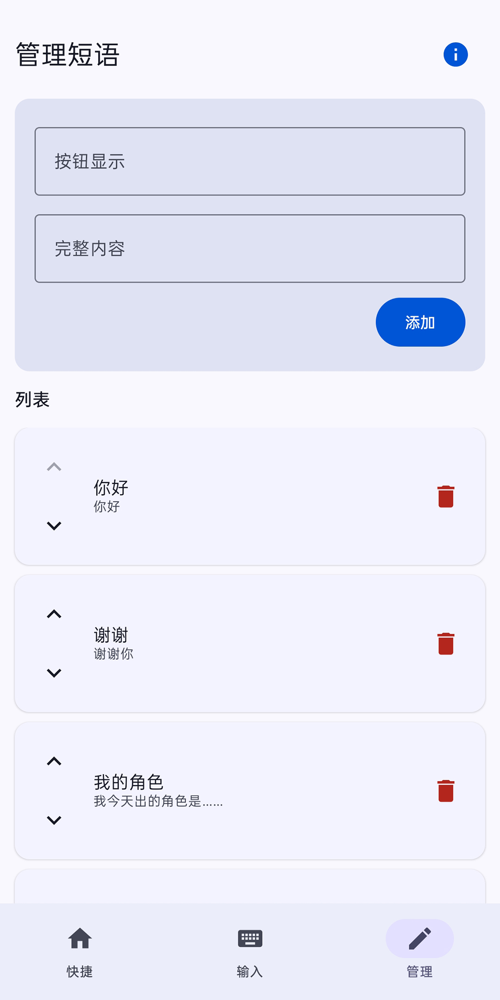

# KigHelper | 娃娃的神之嘴

[](https://developer.android.com)
[](https://kotlinlang.org)
[](https://developer.android.com/jetpack/compose)
[](LICENSE)

> **💡 应用名称征集中！** 如果你有更有创意的名字，欢迎在 Issue 中提出。

此应用的初衷，是为了 Kiger 们方便与他人进行快速高效的沟通。用户可以通过点击预设的卡片，快速在屏幕上显示大字体文字并同步通过语音朗读。

---

## 🌟 核心亮点：锁屏显示

**这可能是目前最懂 Kiger 的辅助沟通 App。**

知周所众，在变娃状态下，指纹识别和面部解锁几乎完全失效。在嘈杂的漫展或外景现场，频繁输入密码解锁手机极其痛苦。

KigHelper 深度适配了 **锁屏显示 Activity** 功能。**无需解锁手机，点亮屏幕即可直接使用预设语，真正做到“即开即说”。
**

### ✨ 功能特性

- 📱 **一键呼应**：点击卡片同步实现巨型文字展示 + 语音朗读，适合各种喧闹场景。
- 🔒 **锁屏可用**：支持在锁屏界面直接唤起，无需指纹、面部或密码解锁。
- 🔔 **常驻通知**：后台运行时自动开启静默通知，通过下拉通知栏或锁屏通知秒回应用。
- 🎨 **现代设计**：采用 Jetpack Compose + Material 3 开发，支持动态配色。

### 👋 谁可以使用？

- Kigurumi 爱好者：在戴上头壳、化身娃态后，无需费力打字，点一下屏幕，即可向摄影师或路人传达想法。
- 言语障碍人士：简洁的交互设计，适合在各种生活场景中作为快捷的交流助手。
- 临时失声需求：因嗓音不适等原因暂时无法说话，或在需要保持安静的特殊环境。

### 📺 演示与交流

如果你想看软件的实际运行效果，了解娃娃们的真实使用体验，欢迎访问：

- **演示视频**：[点击查看视频演示](https://www.bilibili.com/)
- **B 站主页**：[@麒格Ler](https://space.bilibili.com/353197379)

### 界面展示

<table>
  <tr>
    <td></td>
    <td></td>
    <td></td>
  </tr>
  <tr>
    <td align="center">主界面</td>
    <td align="center">输入界面</td>
    <td align="center">编辑预设</td>
  </tr>
</table>
> 更多界面截图见 [screenshots/](screenshots/) 文件夹。

---

## 📝 TODO 路线图

以下功能已列入画饼（划掉）计划，优先级从高到低：

- [ ] **振动反馈**：点击时提供触觉反馈。
- [ ] **音频导入**：支持播放自定义音频文件。
- [ ] **一键扩列**：支持快速弹出个人社交账号或二维码。
- [ ] **导入导出预设**：允许导出和导入自己的短语设置。

以下是更远期的功能设想：

- [ ] **偏好设置**：自定义字体大小、配色等。
- [ ] **短语分类**：支持对短语进行分组。
- [ ] **一键呼叫**：支持快速呼叫后勤。（可能会有后勤端？）

---

## 🔍 关于项目独立性

在本项目核心原型开发完成后，作者通过社区了解到已存在如 KigerTool 和 Kiger-helper 等同类优秀工具。

**在此特作说明**：本项目为 **完全独立开发**，旨在通过 Jetpack Compose 等现代技术栈，解决变娃过程中遇到的需要频繁解锁手机等特定痛点。

我们非常致敬社区先行者的贡献。如果 KigHelper 无法满足您的所有需求，也推荐尝试上述同类软件。

---

## 🤝 参与贡献

我们一起让 KigHelper 变得更完美！你可以：

- 提出建议：如果有任何好玩的想法，请提交 Issue。
- 改进代码：欢迎提交 Pull Request。请保持 Kotlin 风格，尊重本项目的 Compose 架构，遵循最佳实践。

### 🛠️ 技术实现

本项目采用 Kotlin 开发，如果你也是开发者，欢迎参与改进！

- **UI 框架**：[Jetpack Compose](https://developer.android.com/jetpack/compose) (声明式 UI)
- **架构模式**：MVVM (ViewModel + Repository)
- **语音引擎**：Android 原生 `TextToSpeech`
- **窗口管理**：利用 `setShowWhenLocked` 和 `requestDismissKeyguard` 实现锁屏显示
- **数据流**：State / LiveData

### 🤖 关于 Vibe Coding & AI 辅助开发

**本项目深度实践了 Vibe Coding 理念。**

虽然作者是一名 CS 专业的学生，但在开启本项目前并无 Android 开发经验。项目的绝大部分架构设计、功能实现以及复杂
UI 调试，都是在 AI 的辅助下完成的。

我们非常欢迎贡献者也使用 AI 工具来辅助编程。为了保持项目的高质量和可维护性，请遵守以下准则：

1. **AI 友好**：如果你想为本项目贡献代码，完全可以使用 AI 生成初稿或解决逻辑难题。
2. **人工审查**：在提交 Pull Request 之前，**必须经过人工审查**。请确保你理解 AI
   生成的代码逻辑，并确认其符合本项目的架构且没有明显的 Bug。
3. **保持简洁**：AI 有时会生成冗余代码，请在提交前进行必要的重构。

> “代码的终点是实现想法。无论代码是人写的还是 AI 写的，只要它能让 Kiger 们的沟通更顺畅，就是好的代码。”

### 🚀 快速开始

#### 开发环境

- Android Studio Iguana | 2023.2.1 或更高版本
- Kotlin 2.3.x
- JDK 17
- Android SDK 26+ (Android 8.0+)

#### 运行项目

1. 克隆仓库：
   ```bash
   git clone https://github.com/Tairan4356/KigHelper.git
   cd KigHelper
   ```
2. 在 Android Studio 中打开项目。
3. 并在连接的真机或模拟器上运行。
4. **重要提示：为了实现锁屏显示，请确保在手机设置中允许本应用“在锁屏界面显示”。**

## 📄 开源协议

本项目采用 **[GNU General Public License v3.0 (GPL v3)](LICENSE)** 协议开源。

---

## 💖 最后

献给所有热爱 Kigurumi 文化的同好，以及每一个在沉默中努力沟通的灵魂。

